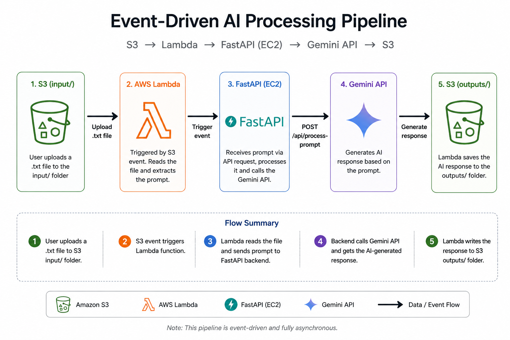
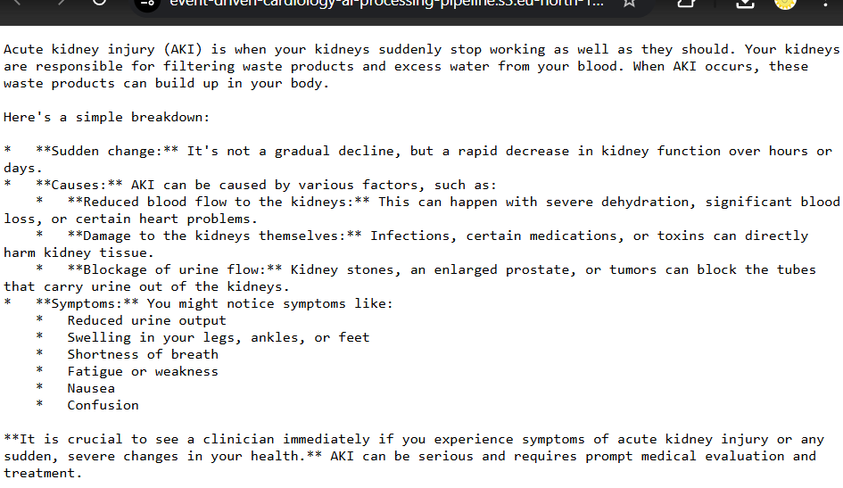
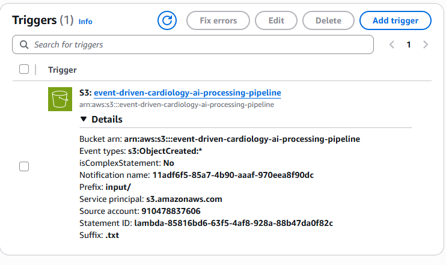
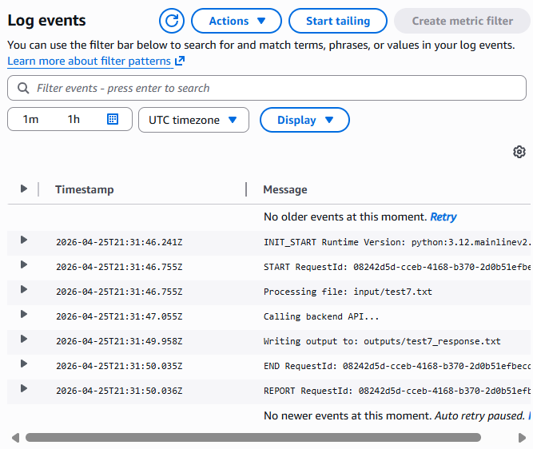
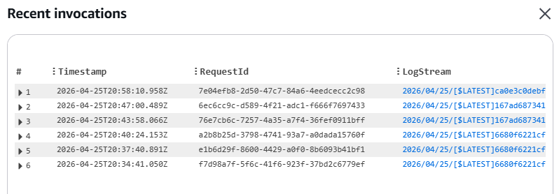

# Event-Driven AI Processing Pipeline (S3 + Lambda + FastAPI)

## Overview

This project implements an **event-driven AI processing pipeline** using AWS services.

Instead of user-triggered UI requests, the system processes prompts asynchronously through file uploads.

A `.txt` file uploaded to Amazon S3 automatically triggers a Lambda function, which:
- Reads the file
- Sends the prompt to a backend API
- Receives an AI-generated response
- Stores the result back in S3

---

## Architecture

S3 (input/)
      ↓
Lambda (triggered on upload)
      ↓
FastAPI backend (EC2)
      ↓
Gemini API (LLM)
      ↓
S3 (outputs/)

---

## Workflow

1. User uploads `.txt` file to `input/` folder in S3
2. S3 triggers AWS Lambda
3. Lambda:
   - Reads file content
   - Calls FastAPI backend
4. Backend:
   - Processes prompt via Gemini API
   - Returns response
5. Lambda:
   - Saves output to `outputs/` folder

---

## Key Components

### 1. Amazon S3
- Input storage (`input/`)
- Output storage (`outputs/`)
- Event trigger source

---

### 2. AWS Lambda
- Event-driven execution
- Reads S3 objects
- Calls backend API
- Writes results back to S3

---

### 3. FastAPI Backend (EC2)
- Handles API requests
- Integrates with Gemini LLM
- Includes fallback mock mode for robustness

---

### 4. Gemini API
- Generates natural language responses
- Integrated via backend

---

## Features

- Event-driven architecture (no manual triggering)
- Asynchronous processing
- Robust error handling (mock mode fallback)
- Secure API key validation
- Cloud-native design

---

## Screenshots

### S3 Input File

### S3 Output File

### Lambda Trigger Configuration

### Lambda Processing Logs

### Lambda Invocations

---

## Test Inputs

Located in:
test_files/

Each file simulates a prompt uploaded to S3.

---

## Setup Summary

### Backend (EC2)
- FastAPI
- Environment variables via `.env`
- Hosted on port 8000

---

### Lambda
- Python runtime
- Uses `urllib` for API calls
- Environment variables:
  - `BACKEND_API_URL`
  - `BACKEND_API_KEY`
  - `OUTPUT_BUCKET`

---

### S3 Trigger
- Event: Object Created
- Prefix: `input/`
- Suffix: `.txt`

---

## Example

### Input (`input/test_aki.txt`)
Explain acute kidney injury in simple terms.

### Output (`outputs/test_aki_response.txt`)
Acute kidney injury (AKI) is when your kidneys suddenly stop working as well as they should. Your kidneys are responsible for filtering waste products and excess water from your blood. When AKI occurs, these waste products can build up in your body.

Here's a simple breakdown:

*   **Sudden change:** It's not a gradual decline, but a rapid decrease in kidney function over hours or days.
*   **Causes:** AKI can be caused by various factors, such as:
    *   **Reduced blood flow to the kidneys:** This can happen with severe dehydration, significant blood loss, or certain heart problems.
    *   **Damage to the kidneys themselves:** Infections, certain medications, or toxins can directly harm kidney tissue.
    *   **Blockage of urine flow:** Kidney stones, an enlarged prostate, or tumors can block the tubes that carry urine out of the kidneys.
*   **Symptoms:** You might notice symptoms like:
    *   Reduced urine output
    *   Swelling in your legs, ankles, or feet
    *   Shortness of breath
    *   Fatigue or weakness
    *   Nausea
    *   Confusion

**It is crucial to see a clinician immediately if you experience symptoms of acute kidney injury or any sudden, severe changes in your health.** AKI can be serious and requires prompt medical evaluation and treatment.

---

## Limitations

- Not production-hardened
- No infrastructure-as-code (Terraform/CDK)
- Basic logging (CloudWatch)
- No authentication beyond API key

---

## Future Improvements

- CI/CD pipeline (GitHub Actions)
- Infrastructure as Code (Terraform)
- Enhanced logging & monitoring
- API Gateway integration
- Secure secret management (AWS Secrets Manager)

---

## Author

**Dr. Sawera Hanif**  
Preventive Cardiologist | Data Scientist | Clinical AI & Data Engineering

Built as part of DevOps coursework taught by Sir Azhar-ul-Islam at IBA in Spring 2026 to demonstrate:

- Event-driven architecture using AWS (S3, Lambda)
- Serverless-triggered backend processing
- Integration with LLM APIs (Gemini)
- End-to-end prompt processing workflow from S3 input to S3 output
